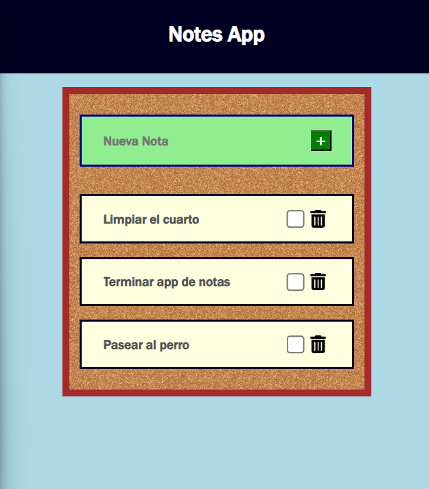

# **Note App (Typescript)**



## _Description_

### App para crear notas con el fin de mantener las notas de la vida cotidiana, ademas de poder marcar las notas como completadas y eliminarlas.


## _Technologies_

- HTML
- CSS
- TypeScript
- Webpack
- Jest

## _Features_

- Agregar notas
- Marcar notas como completadas
- Eliminar notas

## _Author_
- Juan Pacheco

## _License_
- MIT  

<br>
<br>  

**Installation**

```
npm install
```

